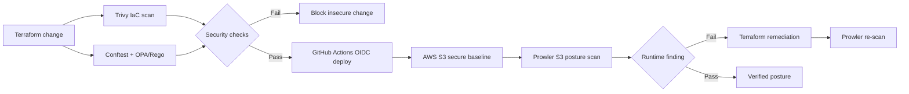
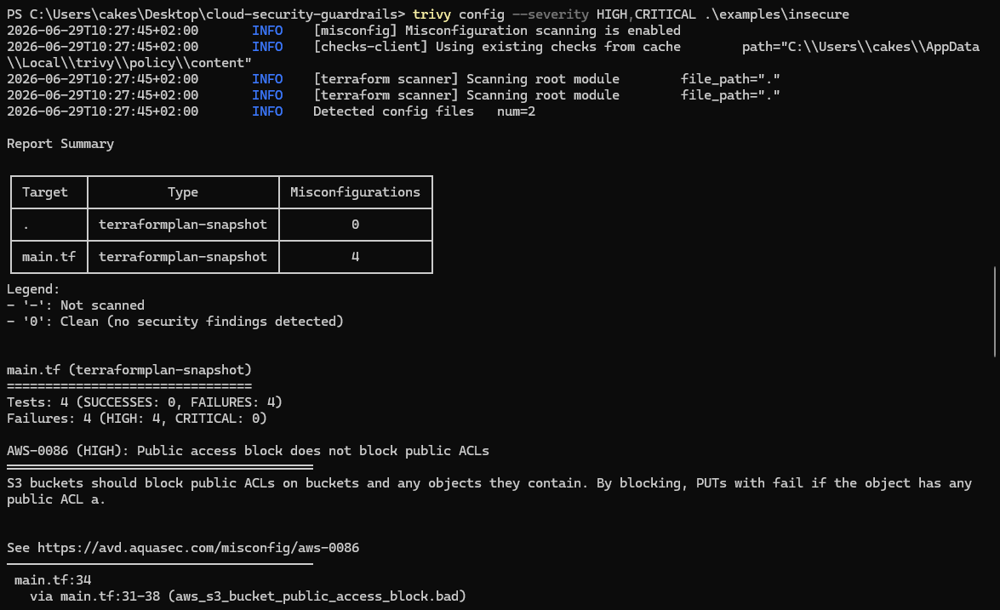
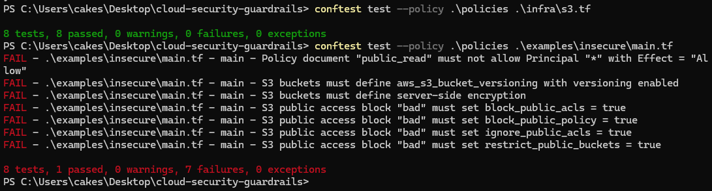
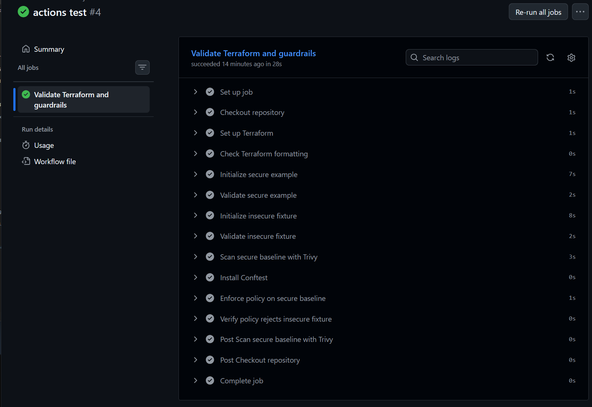
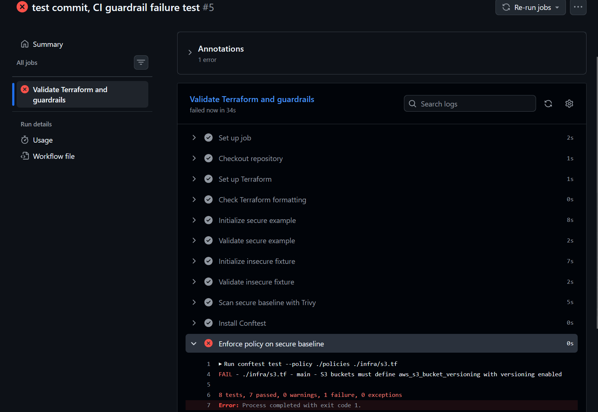
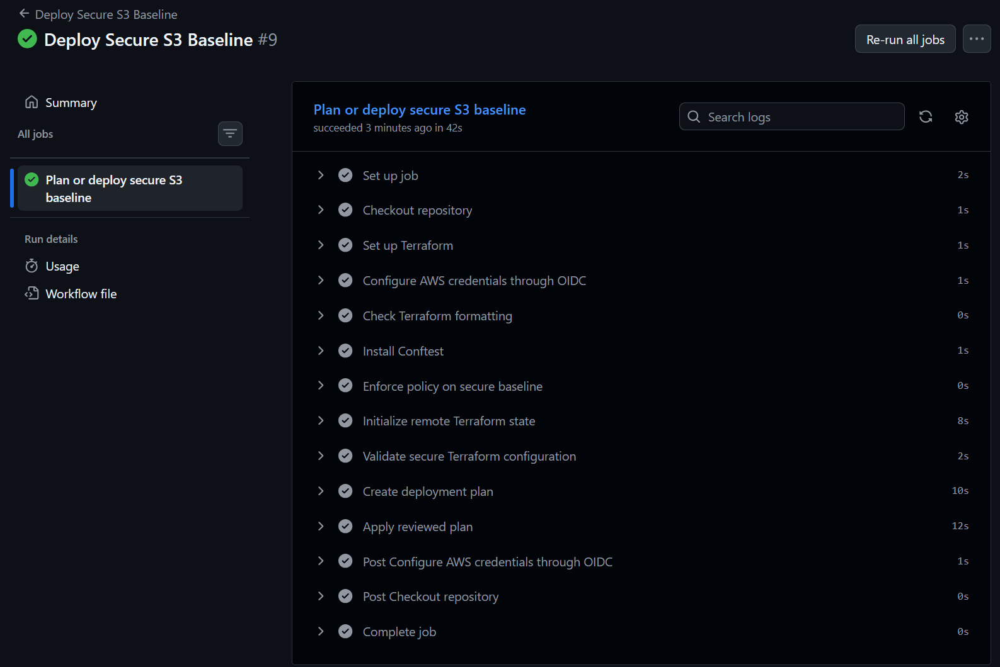
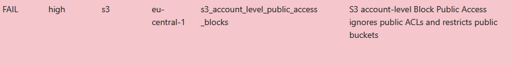
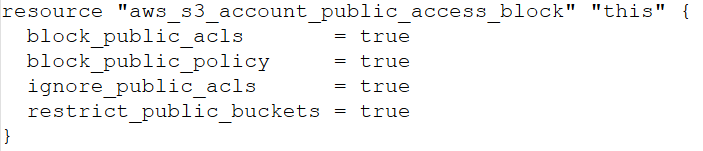
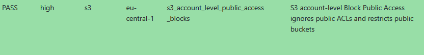

# Secure Cloud Storage Guardrails

Terraform-based AWS S3 security baseline with policy-as-code guardrails, short-lived OIDC deployment, runtime posture detection, and remediation evidence.

## Problem

A misconfigured S3 bucket can expose sensitive reports or data exports publicly. This project demonstrates a preventive and detective approach:

```text
Write Terraform > Scan configuration > Enforce guardrails > Deploy securely > Detect runtime drift > Remediate with Terraform
```

The scenario assumes a financial company storing confidential reports in S3. The goal is to prevent unsafe changes before deployment and verify the deployed AWS posture after deployment.

## What this project enforces

| Control                                      | Risk reduced                      | Enforcement                    |
| -------------------------------------------- | --------------------------------- | ------------------------------ |
| S3 Block Public Access enabled               | Public bucket or object exposure  | OPA/Conftest, Trivy, Terraform |
| Account-level S3 Block Public Access enabled | Public S3 exposure across account | Prowler and Terraform          |
| Bucket versioning enabled                    | Data loss or accidental overwrite | OPA/Conftest                   |
| Server-side encryption configured            | Unencrypted data at rest          | OPA/Conftest                   |
| HTTPS-only bucket access                     | Data exposure in transit          | Terraform bucket policy        |
| No `Allow` with `Principal: "*"`             | Anonymous public object access    | OPA/Conftest                   |
| Runtime S3 posture scan                      | Drift or missing AWS guardrails   | Prowler                        |

## Architecture



## Repository structure

```text
cloud-security-guardrails/
├── bootstrap/              # OIDC roles, Terraform state bucket, account-level S3 guardrails
├── infra/                  # Reusable secure S3 Terraform module
├── examples/
│   ├── secure/             # Uses the secure S3 module
│   └── insecure/           # Intentionally unsafe test fixture
├── policies/
│   └── s3_security.rego    # Custom OPA/Rego guardrails
├── docs/
│   └── images/             # Validation, deployment, and remediation screenshots
├── .github/
│   └── workflows/          # CI, deployment, and Prowler posture scan workflows
├── .trivyignore            # Documented Trivy exception
└── README.md
```

## Secure baseline

The reusable Terraform module configures:

* private S3 bucket
* bucket-level S3 Block Public Access
* bucket ownership enforcement
* versioning
* SSE-S3 encryption (`AES256`)
* HTTPS-only bucket policy
* security-focused resource tags

The bootstrap configuration also configures account-level S3 Block Public Access with `aws_s3_account_public_access_block`.

## Intentionally insecure example

`examples/insecure` exists only to prove that controls work.

It intentionally contains:

* all S3 Block Public Access settings disabled
* no versioning
* no server-side encryption configuration
* public read access through `Principal: "*"` and `Effect: "Allow"`

**Never run `terraform apply` from this directory.**

## Local validation

### Terraform

```powershell
cd examples\secure
terraform init
terraform fmt -check
terraform validate
terraform plan
```

### Trivy IaC scan

```powershell
trivy config --severity HIGH,CRITICAL .\examples\secure
trivy config --severity HIGH,CRITICAL .\examples\insecure
```

The secure example returns no findings after a documented exception for Trivy rule `AWS-0132`. The project intentionally uses SSE-S3 (`AES256`) instead of a customer-managed KMS key to keep the MVP low-cost.

### Custom OPA/Rego guardrails

```powershell
conftest test --policy .\policies .\infra\s3.tf
conftest test --policy .\policies .\examples\insecure\main.tf
```

Expected outcome:

```text
Secure baseline: PASS
Insecure example: FAIL
```

## Guardrail evidence

The secure baseline passes all custom controls. The intentionally insecure configuration fails on public access controls, missing versioning, missing encryption, and a public `Allow` policy.





### GitHub Actions CI

The CI workflow validates Terraform, scans the secure baseline with Trivy, and enforces custom OPA/Rego guardrails.



### Guardrail failure demonstration

A test branch removed S3 versioning from the secure module. GitHub Actions blocked the change because the custom policy requires versioning before deployment.



## Deployment

### OIDC deployment

GitHub Actions deploys the secure S3 baseline through AWS OIDC using short-lived credentials. No long-lived AWS access keys are stored in GitHub Secrets.



## Runtime detection and remediation

After deployment, Prowler scans the deployed AWS S3 posture through a separate read-only audit role. This validates what actually exists in AWS, not just what Terraform code says should exist.

### Finding: account-level S3 Block Public Access

Prowler initially detected that account-level S3 Block Public Access was not fully configured. This was a high-severity finding because bucket-level controls protect individual buckets, but account-level Block Public Access provides a broader safety guardrail across the AWS account.



### Terraform remediation

The issue was remediated in Terraform by adding `aws_s3_account_public_access_block` to `bootstrap/main.tf`.



### Verification

After applying the bootstrap configuration, Prowler was run again. The same check changed from `FAIL` to `PASS`.



### Runtime finding triage

| Finding | Severity | Decision | Result |
| --- | ---: | --- | --- |
| `s3_account_level_public_access_blocks` | High | Remediated | PASS after Terraform apply |
| `s3_bucket_kms_enc` | Medium | Accepted for MVP | SSE-S3 used to avoid customer-managed KMS cost |
| `s3_bucket_server_access_logging_enabled` | Medium | Future work | Requires a dedicated logging bucket |
| `s3_bucket_no_mfa_delete` | Medium | Future work | Operationally complex and not required for MVP |
| `s3_bucket_lifecycle_enabled` | Low | Future work | Useful for version cleanup and cost control |
| `s3_bucket_event_notifications_enabled` | Low | Not in scope | No event-driven workflow in the MVP |
| `s3_bucket_cross_region_replication` | Low | Not in scope | Avoiding extra region and storage cost in lab |
| `s3_bucket_object_lock` | Low | Future work | Compliance hardening, not MVP |

## Current limitations

* The encryption baseline uses SSE-S3 rather than a customer-managed KMS key.
* Server access logging is not enabled yet.
* Cross-region replication, Object Lock, and MFA Delete are documented as future hardening options.
* Raw Prowler reports are not committed to the public repository. Evidence is captured through sanitized screenshots.

## Next steps

* Add a dedicated S3 access logging bucket and enable server access logging.
* Add lifecycle policies for version cleanup and cost control.
* Optionally evaluate customer-managed KMS encryption for stricter compliance requirements.
* Integrate Security Hub after the Prowler baseline is stable.

## Key takeaway

This project demonstrates a full cloud security guardrail loop:

```text
Prevent > Deploy > Detect > Remediate > Verify
```

Insecure S3 configurations are blocked before deployment, the secure baseline is deployed with short-lived OIDC credentials, and runtime findings are remediated through Terraform.
